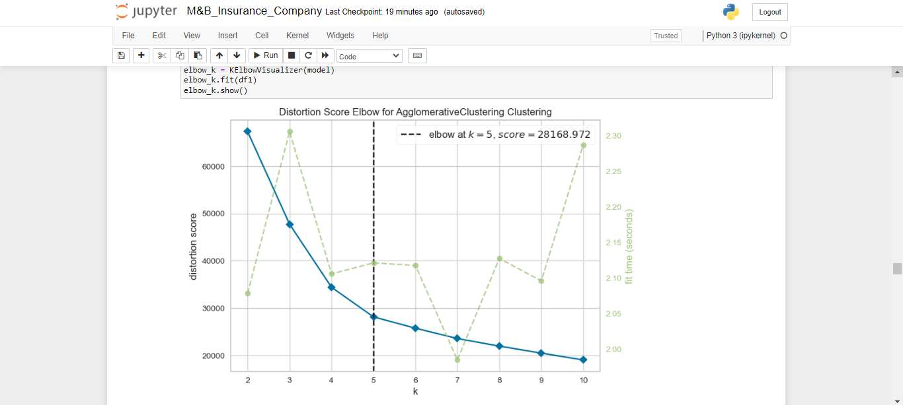
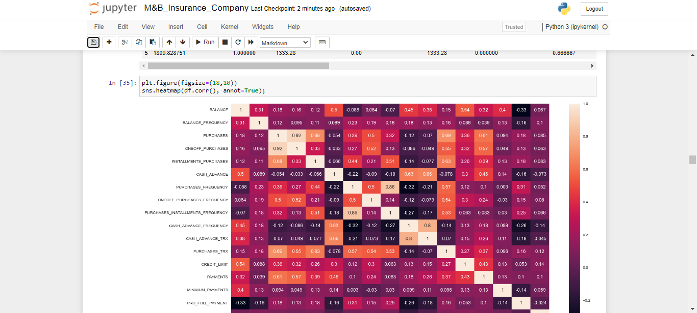

## M&B-Insurance-Customer-Segmentation
Welcome to my Customer Segmentation via Unsupervised Learning repository! This project aims to provide valuable business insights and enable targeted marketing strategies by leveraging the power of unsupervised learning. Through clustering and segmenting customers based on their shared characteristics, I aim to uncover hidden patterns and preferences, empowering businesses to tailor their offerings and enhance customer satisfaction. Stay tuned as I explore the data, apply cutting-edge algorithms, and unlock the potential for data-driven growth in your business!

 

 
